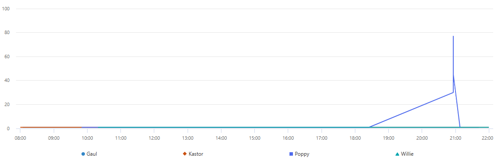

# 🗳️ Case 2: Election Fraud?

### 📖 Scenario
The city of Digitown is in shock: **Poppy the Goldfish** won the mascot election with an improbable 51.7% of the votes. Mayor Gaia Budskott suspects digital tampering in the 5-million-vote dataset. Our mission is to audit the data, identify the fraud mechanism, and recover the true election results.

### 💡 The Investigation Logic
The investigation followed a data-driven approach to separate human behavior from automated scripts:

1. **Initial Audit:** I started by examining the `Votes` table structure (Timestamp, IP, Voter Hash, and Candidate) and noticed that every IP address had cast multiple votes.
2. **Identifying the Anomaly:** By isolating the IP with the highest number of votes, I visualized the traffic using a `timechart`. This revealed a massive, unnatural spike in voting activity occurring at a sub-second frequency.

   
   *Figure 1: Visualizing the voting frequency revealed unnatural spikes in Poppy's favor.*
3. **Threshold Analysis:** Based on the observation that a human cannot realistically cast more than one or two votes per second, I established a **security threshold**. Any activity exceeding 2 votes per second from the same IP was flagged as fraudulent.
4. **Data Sanitization & Recalculation:** I filtered the dataset to exclude these "burst" votes and recalculated the final percentages using the cleaned data.

### 🛠️ Key KQL Techniques Used
- `bin(Timestamp, 1s)` - Used to normalize the time data for high-resolution analysis.
- `render timechart` - Essential for visualizing the "attack" spikes.
- `toscalar()` - To dynamically calculate the total vote count for percentage distribution.

---

### 🚨 Spoiler Alert:
If you want to understand how the fraud was isolated:

Click to reveal the investigation hint

The "smoking gun" was the voting frequency. While legitimate voters were spread out over time, the botnet pushed tens of votes for **Poppy** in single-second intervals. 

By using:
`| where Count <= 2` 
after a `summarize count() by bin(Timestamp, 1s), via_ip`, the fraudulent "noise" was removed, revealing the actual results.

---